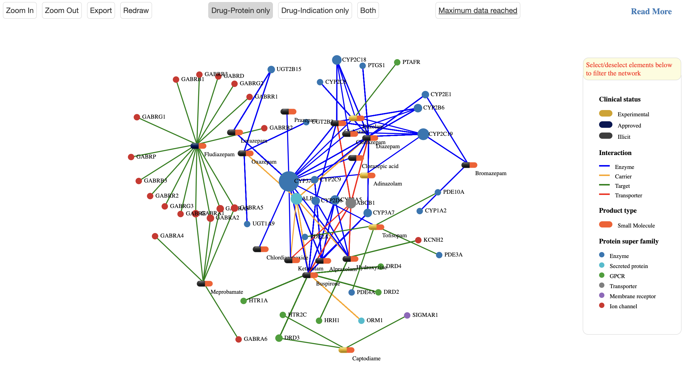

ATC classification hierachy browser
===============

ATC classification hierachy browser
----------------

The ‘ATC classification hierachy browser’  page at https://pgx-db.org/atc_lookup or https://pgxdb.org/atc_lookup provides a streamlined search of ATC codes in all 5 levels:

1.  Querying by anatomical group (1st level)
2.  Querying by therapeutic group (2nd level)
3.  Querying by pharmacological group (3rd level)
4.  Querying by chemical group (4th level)
5.  Querying by chemical substance (5th level)

Clicking any ATC code reveals in the right panel which shows the following information:

1. An overview table lists drugs linked to the selected ATC code and its related subcodes, highlighting interacted protein targetss color-coded by their protein interaction type (e.g. target, enzyme, transporter, carrier), as well as associated indications for each drug. 

2. Beneath the overview table is a panel with five tabs each of which shows a different aspect.

Network visualization
----------------------
  
Presented in the first tab, network visualization provides a tripartite network visualizations for drugs, targets and indication nodes.

.. |br| raw:: html

       

Network Statistics
-------------------

Network Statistics tab provides a summary of the network comprising the drugs, protein targets, and diseases mentioned above. It also includes information on drug types, molecule’s maximum clinical developmental statuses, drug modes of action , phases of clinical trials for drug-disease association studies, and  disease class distributions within the network.

.. image:: images/network_statistics_tab.png
  :width: 700
  :align: center
  :alt: Network statistics

Network comparison
-------------------

Network comparison tab allows users enter an ATC code whose network will be used for comparitive analysis. We provide 13 comparison options including:

      o	Network size comparison: comparing 2 networks based on number of nodes (drugs, targets and diseases), drug-target interactions, and drug-disease associations. This       module can allow end users to detemine complexities between different networks.

      o	Network Adverse Drug Reactions: comparing 2 networks based on number of side effects, their frequencies of drugs within the network. This allows to see if one adverse drug reaction profile is more diverse and frequent.

      o	Degree distribution comparion: comparing 2 networks on distribution of degree of drug-disease association or drug-protein interaction nodes. This helps to understand the connectivity patterns between networks.  

      o	Mode of action distribution comparison: examining the distribution of modes of action (target, transporter, enzyme) for drugs in both networks. This helps to identify if one network has a predominant mode of action.  

      o	Clinical trial phase distribution comparison: analyzing the distribution of clinical trial phases for drug-disease associations in each network. This helps to understand the focus of clinical studies.  
      
      o	Degree of centraliztion comparison: measuring the degree of centralization in each network to identify highly connected drug,disease or target nodes. This checks if one network has a more centralized structure than the other.  
      
      o	Average path length comparison: calculating the average shortest path length between drug, disease or target nodes in each network. This compares the efficiency of information transfer within the networks.  

      o	Community comparison: applying community detection algorithms to identify clusters or modules within each network. This compares the community structures to understand functional modules.  
      
      o	See common and unique network elements: identifying the common drugs, targets, and diseases shared between the two networks. This highlights unique elements in each network to understand their specific characteristics.  

.. image:: images/network_comparison_tab.png
  :width: 700
  :align: center
  :alt: Network comparison

Network Pharmacogenomics
------------------------

Network Pharmacogenomics tab presents specialized pharmacogenomics (PGx) data related to drug-target interactions within the network. It presents both ‘burden data’ on gene-based and variant-specific association statistics and ‘Clinical PGx Data’ from annotated drug label information on all the drug-protein interactions within the network.

When available, the "Clinical PGx Data"   subsection provides detailed variant annotations, including:  
      o	Variant identification  
      o	Drug mode of action related to the variant  
      o	Phenotype category (e.g. efficacy or safety)
      o	Clinical significance and associated p-values  
      o	Biogeographical distribution (ancestries) and other relevant metrics 

The "Burden data" subsection displays results from burden tests, which assess the aggregate impact of genetic variants on genes (proteins) in relation to the phenotypes (drugs) within the network. This data is further categorized into gene-based and variant-based statistics, for which both statistical significance (p-value) and strength of association (BETA) are presented derived from burden tests. For each association pair, up to four functional annotation categories can be selected: 
    o	predicted Loss-of-Function (pLoF), 
    o	missense|LC (including low-confidence pLoF variants and in-frame insertions or deletions)
    o	synonymous
    o	the combination pLoF and missense|LC group. 
Additionally, the underlying number of cohort cases and controls are presented.

.. image:: images/network_pgx_tab.png
  :width: 700
  :align: center
  :alt: Network pharmacogenomics

Network drug adverse reaction
-----------------------------

Network drug adverse reaction tab shows adverse reaction, if available, for drugs within the network collected from SIDER (http://sideeffects.embl.de/). This information is extracted from drug labels and is based on data available in the MedDRA (Medical Dictionary for Regulatory Activities) dictionary. If the percentage value for a given id had been given as an interval (e.g. 8-10), we selected the upper bound (10, in this case). Of note, the frequency is not necessarily related to the number of studies that reported the adverse drug reaction. Instead, it represents the proportion of patients in a study who experienced adverse reactions. This information is useful for understanding the prevalence of adverse reactions associated with a particular medication and can help inform clinical decisions about its use. The frequencies are color coded by frequency (orange fewer, red for more frequent observations).

.. image:: images/network_adr_tab.png
  :width: 700
  :align: center
  :alt: Network adverse drug reaction

