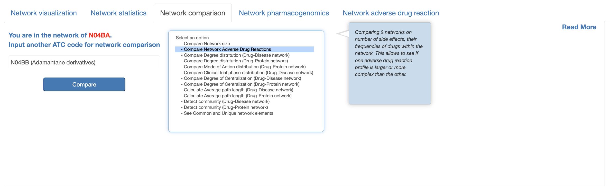

ATC codes
===============

ATC code browser
----------------

The ‘ATC code browser’  page at https://pgx-db.org/atc_lookup provides a streamlined search of ATC codes in all 5 levels:

1.  Querying by anatomical group
2.  Querying by therapeutic group
3.  Querying by pharmacological group
4.  Querying by chemical group
5.  Querying by chemical substance

Clicking any ATC code reveals in the right panel which shows the following information:

1. An overview table lists drugs linked to the selected ATC code and its related subcodes, highlighting interacted protein targetss color-coded by their mode of action, as well as associated diseases for each drug. 

2. Beneath the overview table is a panel with five tabs each of which shows a different aspect.

Network visualization
----------------------
  
Presented in the first tab, network visualization provides a tripartite network visualizations for drugs, targets and disease nodes.

.. |br| raw:: html

       

.. image:: images/network_visualization_tab.png
  :width: 700
  :align: center
  :alt: Network visualization

Network Statistics
-------------------

Network Statistics tab provides a summary of the network comprising the drugs, protein targets, and diseases mentioned above. It also includes information on drug types, molecule’s maximum clinical developmental statuses, drug modes of action , phases of clinical trials for drug-disease association studies, and  disease class distributionswithin the network.

Network comparison
-------------------

Network comparison tab allows users enter an ATC code whose network will be used for comparitive analysis. We provide 12 comparison options including:

      o	Network size comparison: comparing 2 networks based on number of nodes (drugs, targets and diseases), drug-target interactions, and drug-disease associations. This       module can allow end users to detemine complexities between different networks.

      o	Degree distribution comparion: comparing 2 networks on distribution of degree of drug-disease association or drug-protein interaction nodes. This helps to understand the connectivity patterns between networks.  

      o	Mode of action distribution comparison: examining the distribution of modes of action (target, transporter, enzyme) for drugs in both networks. This helps to identify if one network has a predominant mode of action.  

      o	Clinical trial phase distribution comparison: analyzing the distribution of clinical trial phases for drug-disease associations in each network. This helps to understand the focus of clinical studies.  
      
      o	Degree of centraliztion comparison: measuring the degree of centralization in each network to identify highly connected drug,disease or target nodes. This checks if one network has a more centralized structure than the other.  
      
      o	Average path length comparison: calculating the average shortest path length between drug, disease or target nodes in each network. This compares the efficiency of information transfer within the networks.  

      o	Community comparison: applying community detection algorithms to identify clusters or modules within each network. This compares the community structures to understand functional modules.  
      
      o	See common and unique network elements: identifying the common drugs, targets, and diseases shared between the two networks. This highlights unique elements in each network to understand their specific characteristics.  

Network Pharmacogenomics
------------------------

Network Pharmacogenomics tab presents specialized pharmacogenomics (PGx) data related to drug-target interactions within the network. When available, the "Clinical PGx Data"   subsection provides detailed variant annotations, including:  

      o	Variant identification  
      
      o	Drug mode of action related to the variant  
      
      o	Phenotype category  
      
      o	Clinical significance and associated p-values  
      
      o	Biogeographical distribution and other relevant metrics 

Additionally, the "Burden Data" subsection displays results from burden tests, which assess the aggregate impact of genetic variants on genes (proteins) in relation to the phenotypes (drugs) within the network. This data is further categorized into gene-based and variant-based statistics.

Network drug adverse reaction
-----------------------------

Network drug adverse reaction tab shows adverse reaction, if available, for drugs within the network. For each drug reaction or side effect, we provide a short side effect definition and the frequency found on the surveyed population. We also use color coding to classify different side effects (e.g., orange for less severe and red for severe side effects). 

