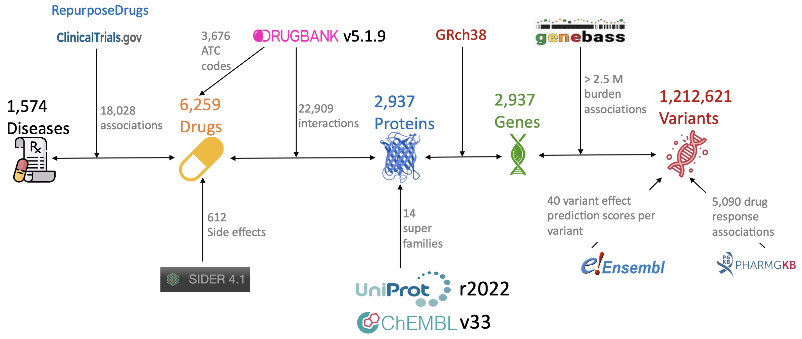
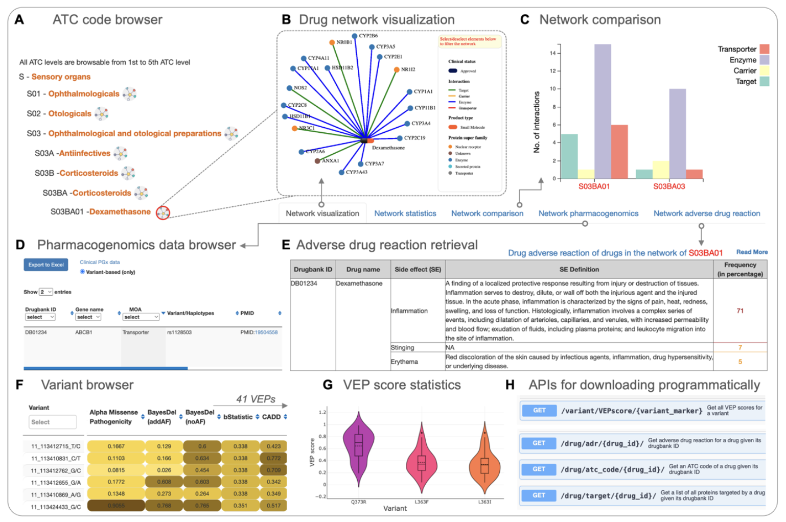

Graphical overview
==============

Our resource provides a comprehensive overview of diverse data types,  serving as a centralized hub for pharmacogenomics data search and browsing. The integrated data encompasses drug, disease, target, corresponding genes as well as their variants. In addition, it is important to know the effects of variants in different aspects. We therefore also collected variant effect prediction (VEP) scores, gene-based association summary statistics, and pharmacogenomics data. Apart from the 4 basic entities drug, diease, target and variant mentioned above, their relationships (interactions, associations, adverse reaction, variants affecting drug responses) are also collected and organized based on Anatomical Therapeutic Chemical property classification of drugs).  

**Data collection workflow** |br||br||br||br|

Based on the data collected, we provide different functions to efficiently retrieve those data which can be grasped quickly in the snapshot below

**Snapshot of PGx functionalities:** *(A) Tree-like browser that allows for finding ATC codes of all level from Anatomical group to Chemical substance group. A click on the button next to each ATC code description open a network detail in the right panel (B) Network visualization of the drug-protein interactions and drug-disease association studies. (C) Network feature comparison for 2 different ATC codes (D) browsable table showing specialized pharmacogenomics data related to drug-target interactions within the network (E) Table displaying adverse drug reaction of drugs within the network (F) Variant browsing tool for a selected gene with variant effect prediction scores from 41 distinct algorithms in color gradient ranging from 0 to 1 (G) Accompanying chart displays violin plots of effect prediction scores for currently selected variants (H) Some examples of API endpoints.* 

