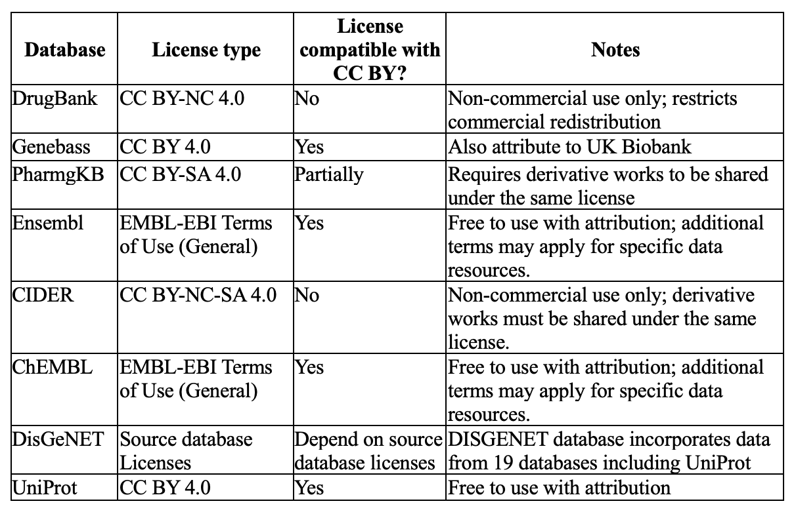

Legal notice
============

Formal
------

The PGxDB server and data suite is a free data distribution system. The data and the server are distributed in the
hope that it will be useful, but WITHOUT ANY WARRANTY without even the implied warranty of merchantability or fitness
for a particular purpose. The copyright holders and/or other parties provide the data "AS IS", without warranty of any
kind, either expressed or implied. The entire risk as to the quality and performance of the data is with you. Should
any data prove defective, you assume the cost of all necessary servicing, repair or correction.

The copyrights for ALL information stored in the PGxDB belongs to the partners in the PGxDB project unless stated
otherwise. The table below shows source databases and corresponding licenses. It is free to make unlimited use of the PGxDB data. The use of data or services provided by the PGxDB
project should be acknowledged the classical way by referring to the articles written by the PGxDB project partners,
and preferably also by mentioning: “We acknowledge the use of the PGxDB database (https://www.pgx-db.org)”.

.. |br| raw:: html

       

Informal
--------

The complete PGxDB source code is freely available on `GitHub`_ under the `Apache 2.0 license`_. This means that
the code can be used, modified and distributed for any use (including commercial use), as long as the original license
and copyright notice are included with the code, and any significant changes stated.

.. _GitHub: https://github.com/Duong-NguyenTrinhTrung/pgx-db
.. _Apache 2.0 license: https://www.apache.org/licenses/LICENSE-2.0.html

The data in PGxDB is freely available under the `Creative Commons Attribution 4.0 International license`_. This means
that the data can be copied, redistributed, remixed, transformed and built upon, as long as appropriate credit is
giving, a link to the license provided and any changes stated.

.. _Creative Commons Attribution 4.0 International license: https://creativecommons.org/licenses/by/4.0/

Privacy
-------

We voluntarily maintain the following privacy rules:

*   We collect usage statistics with Google Analytics
*   We take all possible measures to ensure that all detailed usage will remain secret.
*   Usage data will not be sold or shared with third parties unless for academic purposes, and after we obtained the
    guarantee that our voluntary privacy rules will be obeyed.
*   Detailed usage data will only be used by the site curators for optimisation and error detection purposes.
*   We reserve the right to publicise, on our site, the names or internet address of any site using this resource,
    including frequencies of usage and breakdown of usage data types and tools (not individual receptor targets).
*   We reserve the right to occasionally make the usage statistics available to granting 
